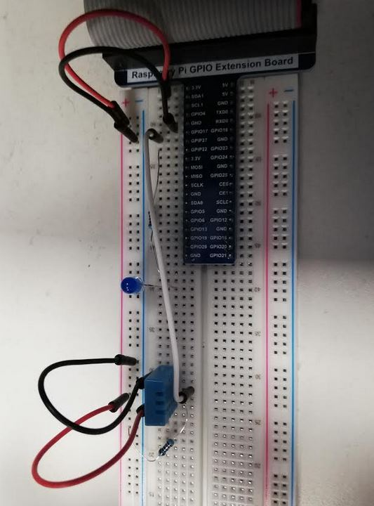

This device application is designed to read the values from the DHT11 sensor.

The sensor should be attached to a Raspberry Pi as follows:
Pin 1: 3.3v
Pin 2: GPIO17 and also via a 10KOhm resistor to 3.3v
Pin 3: Not connected
Pin 4: Ground

The sensor is described here: https://learn.adafruit.com/dht
This extends the sample code from https://raw.githubusercontent.com/Freenove/Freenove_RFID_Starter_Kit_for_Raspberry_Pi/master/Code/Python_Code/21.1.1_DHT11/Freenove_DHT.py

